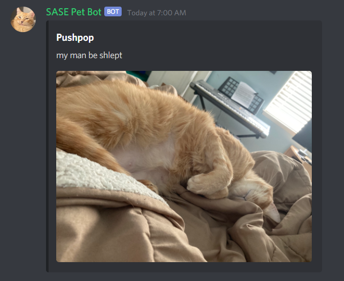

# SASE Pet Bot

> College is a stressful. At 7AM every day, get your daily dose of serotonin when this bot posts a photo of a SASE member's pet and feel slightly better about your day. Who doesn't love pets?

## Table of contents

* [General info](#general-info)
* [Screenshots](#screenshots)
* [Technologies](#technologies)
* [Setup](#setup)
* [Features](#features)
* [Status](#status)
* [Inspiration](#inspiration)
* [Contact](#contact)

## General info

I developed this project initially to add to my resume and learn about how to work with AWS technologies as well as some databases like
DynamoDB. However, as I progressed through this project, I realized that I could repurpose it to add interactivity to NEU SASE's
(Northeastern University Society of Asian Scientists and Engineers) Discord server. Since many love to admire and adore pet photos, I
built this bot to allow members of the SASE Discord to upload photos of their pets to a database through the bot and the bot would
display one randomly chosen pet photo from this database every day at 7AM EST to give members a shot of serotonin before grinding
through the day's classes/work.

## Screenshots

Example post of a pet photo:

## Technologies

* @aws-sdk/client-dynamodb - version 3.14.0
* @aws-sdk/client-s3 - version 3.14.0
* @babel-runtime - version 7.14.0
* discord.js - version 12.5.3
* dotenv - version 8.2.0
* node-schedule - version 2.0.0
* nodemon - version 2.0.7
* request - version 2.88.2

## Setup

Currently, set up for the bot is complicated and convoluted as it requires the set up of multiple different pieces of AWS technology as well as setting up WinSCP to connect to an AWS EC2 Instance (this is used to host the bot on the cloud), so as of now there is no provided set up due to the high degree of set up difficulty.

## Code Examples

How to use the !upload command after uploading your pet photo using and are at the point where Discord asks if you want to add optional comments (you want to add optional comments or your upload won't work):

Type
`!upload [insert pet name] | [insert a message to go with the photo]`
in the section where Discord asks to "ADD A COMMENT (Optional)".

## Features

Current features:

* Randomly selects a pet photo from a database and posts it to the Discord server every day at 7PM EST.
* Allows users to upload a photo of their pet that they would like to be posted by the bot.
* Optional parameters included in the upload are the pet name and a short message to go with the pet photo.

To-do list:

* Improve functionality of the !report command to allow users to submit any bug or issues regarding the bot and have them stored in a database for me or any future developers on this project to look at and address.
* Let users edit their submissions of their pet photos (only the optional parameters) after already submitting to the database.
* Look into possibility of rewriting the code with an object-oriented style.
* Improve visuals of the Discord embed messages posted (for both the daily pet photo post as well as what is displayed from all the commands).
* Improve the !help command to also explain all the other possible commands this bot responds to.
* Add status referring to !help command
* Add !github command to link to the bot's Github repo
* Add !request command to queue up to 5 photos to be posted in the following days

## Status

Project is: _finished_ but is still being worked on for future updates.
Most recent version: 1.0.1

## Inspiration

Project inspired by the people in the SASE Discord who kept asking for photos of my cats, so now they can stop asking me for my cat photos.

## Contact

Created by [@jpwaves](https://github.com/jpwaves) (I don't currently have a website to be contacted at, but that is currently in development!)
